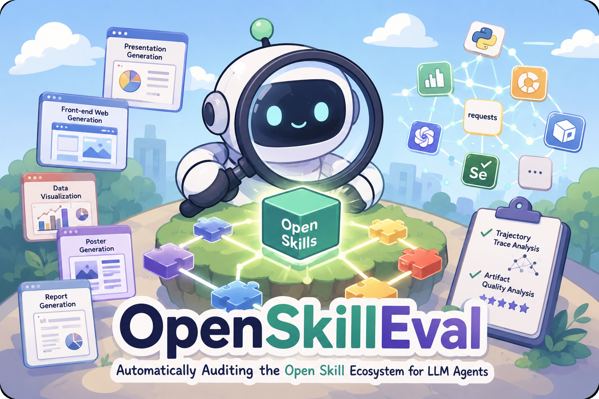
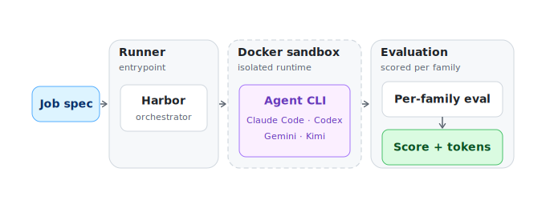

<h1 align="center">OpenSkillEval</h1>

<p align="center">
  
</p>

<div align="center">

[](https://arxiv.org/abs/2605.23657)
[](https://yingjiahao14.github.io/OpenSkillEval-Web/)
[](https://huggingface.co/datasets/jhying/OpenSkillEval)
[](LICENSE)
[](https://creativecommons.org/licenses/by-nc/4.0/)

</div>

> **Automatically auditing the open skill ecosystem for LLM agents.** OpenSkillEval holds the task fixed and varies the *skill* — so you can isolate how much community-contributed skill packs actually change the quality and cost of agent outputs.

---

## 🌱 Why OpenSkillEval?

- **An audit of the open skill ecosystem**, not just a model leaderboard — we ask whether community-contributed skill packs actually move the needle on real agentic work.
- **Five high-utility families** that map to how people use agents today: data visualization, posters, slide decks, analytical reports, and web design.
- **Controlled skill-vs-baseline + concrete takeaways for skill authors**: every skill pack runs head-to-head against a `no-skill` baseline on the same case set / same judge / same model, surfacing which design patterns (format, structure, prior richness) translate to real gains and which only add cost.
- **Joint quality + cost accounting**: every run logs prompt / completion / cache tokens and wall-clock seconds, so you can read a skill's value against what it costs to invoke.

---

## 🗂 Task Families

| Family (config) | Cases | Artifact | One-liner |
|---|:---:|:---:|---|
| 📊 &nbsp;`data-visualization` | 150 | `png` | Multi-track timelines, comparative charts, and analytical visualizations from structured data. |
| 🖼️ &nbsp;`poster-generation` | 119 | `png` | Single-page data-forward posters from a structured brief. |
| 📑 &nbsp;`ppt-generation` | 82 | `pptx` | Slide decks with a target slide count and accompanying jpg/png/pdf assets. |
| 📝 &nbsp;`report-generation` | 195 | `html` | Long-form analytical reports backed by a real CSV with KPIs and analysis dimensions. |
| 🌐 &nbsp;`web-design` | 131 | `html` | Multi-page sites with navigation, interactions, and responsive / dark-mode flags. |

**677 cases** across business, science, health, engineering, and creative domains.

---

## 🏆 Leaderboard

> 🎯 **Headline.** **Claude Opus 4.6** takes the top slot at **4.51** overall, edging GPT-5.5 (**4.47**) and Claude Sonnet 4.6 (**4.43**). The frontier is tight — top four within **0.09 points** — but real costs spread **25×** across the board. The USD Pareto frontier is **MiniMax M2.7 → DeepSeek V4 Pro → Claude Sonnet 4.6 → Claude Opus 4.6**; everything else is strictly dominated.

| # | Model | Agent | Overall | Data&nbsp;Viz | Poster | PPT | Report | Web | Cost |
|---|---|---|---:|---:|---:|---:|---:|---:|---:|
| 🥇 | **Claude&nbsp;Opus&nbsp;4.6** | Claude&nbsp;Code | **4.51** | 4.56 | 4.23 | 4.41 | 4.60 | 4.74 | 16.4× |
| 🥈 | **GPT-5.5** | Codex | **4.47** | 4.28 | 4.13 | **4.49** | **4.63** | **4.80** | 25.4× |
| 🥉 | **Claude&nbsp;Sonnet&nbsp;4.6** | Claude&nbsp;Code | **4.43** | 4.45 | 4.02 | 4.33 | 4.62 | 4.75 | 11.9× |
| 4 | **GLM-5.1** | Claude&nbsp;Code | 4.42 | 4.43 | 4.03 | 4.47 | 4.42 | 4.74 | 13.9× |
| 5 | **DeepSeek&nbsp;V4&nbsp;Pro** | Claude&nbsp;Code | 4.30 | 4.23 | 3.94 | 4.25 | 4.36 | 4.73 | **1.8×** |
| 6 | **Kimi&nbsp;K2.6** | Kimi&nbsp;CLI | 4.20 | 4.13 | 3.88 | 4.17 | 4.43 | 4.40 | 2.5× |
| 7 | **GPT-5.2** | Codex | 4.03 | 3.58 | 3.67 | 4.07 | 4.17 | 4.66 | 14.9× |
| 8 | **MiniMax&nbsp;M2.7** | Claude&nbsp;Code | 4.02 | 3.76 | 3.55 | 4.13 | 4.03 | 4.63 | **1.0×** |
| 9 | **Gemini&nbsp;3.1&nbsp;Pro** | Gemini&nbsp;CLI | 4.00 | 4.00 | 3.74 | 3.90 | 3.79 | 4.55 | 4.7× |
| 10 | **GPT-5.3&nbsp;Codex** | Codex | 3.76 | 3.26 | 3.68 | 3.67 | 3.73 | 4.47 | 2.3× |

**Highlights.** ✨ **Claude Opus 4.6** is the most balanced — never drops below 4.23 on any axis — and the value pick at the top tier (16.4× cheapest beats GPT-5.5's 25.4× at *higher* quality). **GPT-5.5** wins three families outright (Web 4.80 · PPT 4.49 · Report 4.63) but is strictly dominated in USD — Opus beats it on both quality and cost. **Claude Sonnet 4.6** is the mid-tier value pick: 4.43 overall at 11.9×. **DeepSeek V4 Pro** is the open-weights price-quality champion (1.8×, 4.30 overall). **MiniMax M2.7** anchors the floor at **1.0×** and still clears 4.0 overall — the budget pick.

> **Methodology.** Each row is a (model, agent-CLI) pair — providers without their own CLI (GLM, DeepSeek, MiniMax) are evaluated through Claude Code as the host harness. Per-family scores are **case-level rubric means** (the case set already spans all skill variants, so each cell averages over the skill dimension), then averaged across each family's task-specific sub-metrics (e.g. content quality · visual design · completeness · fidelity for PPT). **Overall** is the mean across the 5 family scores. Per-sub-metric breakdown — and the per-cell standard deviations — are in the paper. **Cost** is the per-case USD ratio against the cheapest model (MiniMax M2.7), computed by applying the per-1M-token input / output / cache prices from [`model-pricing.json`](https://github.com/yingjiahao14/OpenSkillEval-Web/blob/main/data/model-pricing.json) to the per-family token usage in [`token-usage.json`](https://github.com/yingjiahao14/OpenSkillEval-Web/blob/main/data/token-usage.json). Snapshot at release time — live numbers on the [companion site](https://yingjiahao14.github.io/OpenSkillEval-Web/).

---

## 🧪 The skill ecosystem

> 🎯 **Headline.** In every family, *the worst skill drags scores below the no-skill baseline* — picking the wrong skill is strictly worse than skipping skills entirely. **PPT** and **Poster** are the only families where the best skill clears noise (+0.20, +0.16); the rest are within ±0.04 of baseline.

| Family | Cases | Skills | Baseline | Best skill | Δ | Worst skill | Δ |
|---|---:|---:|---:|---|:---:|---|:---:|
| 📊 &nbsp;**Data** | 150 | 6 | 4.21 | `anthropics` | ⚪<br>**±0.00** | `visualize` | 🔴<br>**−0.28** |
| 🖼️ &nbsp;**Poster** | 119 | 4 | 3.93 | `visualize` | 🟢<br>**+0.16** | `paper-poster` | 🔴<br>**−0.25** |
| 📑 &nbsp;**PPT** | 82 | 6 | 4.15 | `ppt-master` | 🟢<br>**+0.20** | `frontend-slides` | 🔴<br>**−0.10** |
| 📝 &nbsp;**Report** | 195 | 6 | 4.26 | `business-auto` | 🟢<br>**+0.04** | `excel-report` | 🔴<br>**−0.02** |
| 🌐 &nbsp;**Web** | 131 | 8 | **4.67** | `expert` | 🟢<br>**+0.02** | `frontend-ultimate` | 🔴<br>**−0.17** |

<sub>Skill names are family-relative — e.g. `anthropics` under Data is the full slug `data-viz-anthropics`. `visualize` appears under two families with two different upstream skills.</sub>

**Read it together.** 🟢 = beats baseline · ⚪ = ties baseline · 🔴 = worse than no skill. **PPT** has the biggest upside (`ppt-master` +0.20) *and* the safest downside (worst skill only loses 0.10). **Poster** has the widest spread — 0.41 points between best and worst — meaning skill choice matters most here. **Data** is the only family where *no* skill clears baseline; the catalog's best is just a tie. **Web** already sits at 4.67 baseline so there's barely any ceiling left for skills to claim.

---

## ⚙️ Quick Start

OpenSkillEval expects Python 3.11+, [uv](https://docs.astral.sh/uv/), Docker,
and the agent CLI(s) you want to evaluate installed on the host.

1. **Clone and sync deps.**

   ```bash
   git clone git@github.com:ALEX-nlp/OpenSkillEval.git
   cd OpenSkillEval
   uv sync
   ```

2. **Download cases from Hugging Face.** Cases are not vendored in this repo;
   the script pulls them into `tasks/<family>/` from
   [`jhying/OpenSkillEval`](https://huggingface.co/datasets/jhying/OpenSkillEval).

   ```bash
   python scripts/download_cases.py
   ```

3. **Fill in your agent credentials and run a smoke case.** Snippets under
   `agent_configs/snippets/` ship with `<your-…-api-key>` placeholders. Fill
   in `ANTHROPIC_API_KEY` inside `agent_configs/snippets/claude-code.snippet`,
   then launch a one-case run:

   ```bash
   # edit agent_configs/snippets/claude-code.snippet — fill ANTHROPIC_API_KEY

   uv run python tools/runner/run_variants.py \
     --runner "claude-code|claude-opus-4-6|1" \
     --runs 1 \
     "data-visualization|data-viz-anthropics|case-ai-evolution-timeline|force-using"
   ```

   See [`tools/runner/README.md`](tools/runner/README.md) for the full CLI
   surface (entry format, multi-runner, `--resume`, etc.).

4. **Score the smoke run with a VLM judge.** Each family ships its own
   evaluator under `eval/<family>-eval/`. The pipelines whitelist the shell
   env and read judge credentials *only* from
   `agent_configs/snippets/judge.snippet` via `@VAR_NAME` placeholders —
   exporting `ANTHROPIC_API_KEY` in your shell will not work. Fill in the
   key inside `agent_configs/snippets/judge.snippet`, then run the dataviz
   judge over the case you just generated:

   ```bash
   # edit agent_configs/snippets/judge.snippet — fill ANTHROPIC_API_KEY

   uv run --project eval/dataviz-eval python eval/dataviz-eval/scripts/pipeline.py \
     smoke_jobs/data-visualization/ \
     --judge "claude-opus-4-6|anthropic|https://api.anthropic.com|@ANTHROPIC_API_KEY"
   ```

   `data-visualization` / `report-generation` / `web-design` use a
   two-stage shape (in-Docker eval agent + VLM judge), so they need a
   running `docker` daemon and `harbor` on `PATH`. `poster-generation` is
   judge-only — no stage 1, no Docker, fastest smoke. `ppt-generation` is
   a three-machine workflow (Linux pack → macOS PowerPoint+PyMuPDF
   rasterise → Linux judge); see
   [`eval/ppt-eval/README.md`](eval/ppt-eval/README.md). Swap the judge by
   editing the `--judge` spec (`<model>|<provider>|<base_url>|<api_key>`);
   `claude-opus-4-6` matches the snapshot leaderboard, but Sonnet is a
   cheaper choice when you're just sanity-checking the wiring.
   Outputs land under `eval/<family>-eval/output/<run-id>/` (default
   `eval_result`); reusing `--run-id` resumes by skipping existing
   `judge_result_<model>.json` files.

---

## 📂 Repo layout

```
OpenSkillEval/
|-- agents/          # per-agent-CLI adapters (Claude Code, Codex, Gemini, Kimi)
|-- agent_configs/   # snippet templates for model + framework + skill combos
|-- assets/          # hero image + per-model label SVGs used by the dataset card
|-- entries/         # hand-curated entry lists for the 5 families
|-- eval/            # per-family evaluators (one subdir per task family)
|-- scripts/         # case downloader
|-- tasks/           # case directories, populated by scripts/download_cases.py
|-- tools/           # runner (drives harbor + docker per agent run)
`-- pyproject.toml   # uv-managed project metadata
```

---

## 🔬 Per-family evaluators

Each family has its own evaluator with its own README covering rubric,
artifact format, and scoring details:

- [`eval/dataviz-eval/README.md`](eval/dataviz-eval/README.md)
- [`eval/poster-eval/README.md`](eval/poster-eval/README.md)
- [`eval/ppt-eval/README.md`](eval/ppt-eval/README.md)
- [`eval/report-eval/README.md`](eval/report-eval/README.md)
- [`eval/webdesign-eval/README.md`](eval/webdesign-eval/README.md)

---

## Architecture

A single runner schedules cases across a fleet of containerized agent CLIs. The runner reads a job spec, dispatches work through harbor (the lightweight job broker), spins each agent in its own Docker sandbox with the case files mounted, captures the agent's output artifact + token usage, and hands the artifact to the matching per-family evaluator. Evaluators are independent and versioned per family so judging logic can evolve without touching the runner.

<p align="center">
  <picture>
    <source media="(prefers-color-scheme: dark)" srcset="assets/benchmark_pipeline_github_dark.svg">
    
  </picture>
</p>

---

## 📦 Dataset

The 677 benchmark cases live on Hugging Face:
[`jhying/OpenSkillEval`](https://huggingface.co/datasets/jhying/OpenSkillEval).
The dataset ships five configs (one per family) plus the raw case directories
under `cases/<family>/<case_id>/` for users who need the original
`instruction.md`, `source_brief.md`, `source_data.json`, `data.csv`, or asset
files. `scripts/download_cases.py` fetches the raw subtree into `tasks/`.

---

## 📜 License

- Code in this repository is licensed under [**Apache-2.0**](LICENSE).
- The benchmark cases hosted at `jhying/OpenSkillEval` are licensed under
  **CC-BY-NC-4.0**.

---

##  Citation

```bibtex
@article{ying2026openskilleval,
  title  = {Automatically Auditing the Open Skill Ecosystem for LLM Agents},
  author = {Ying, Jiahao and Ai, Boxian and Tang, Wei and Liu, Siyuan and Cao, Yixin},
  journal= {arXiv preprint arXiv:2605.23657},
  year   = {2026},
  url    = {https://arxiv.org/abs/2605.23657}
}
```

---

##  Acknowledgments

OpenSkillEval's runner is built on top of [**harbor**](https://github.com/harbor-framework/harbor) — the lightweight job broker that schedules every per-agent Docker sandbox in this benchmark. Thanks for shipping it.
