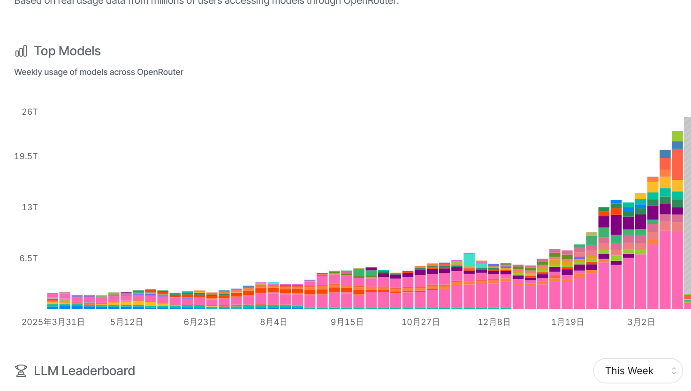
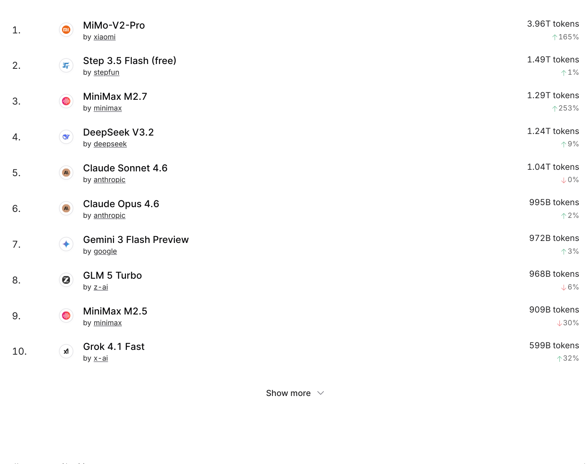
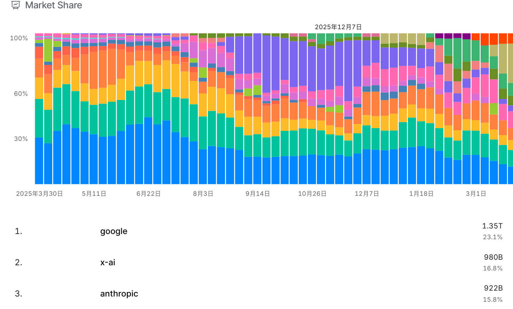
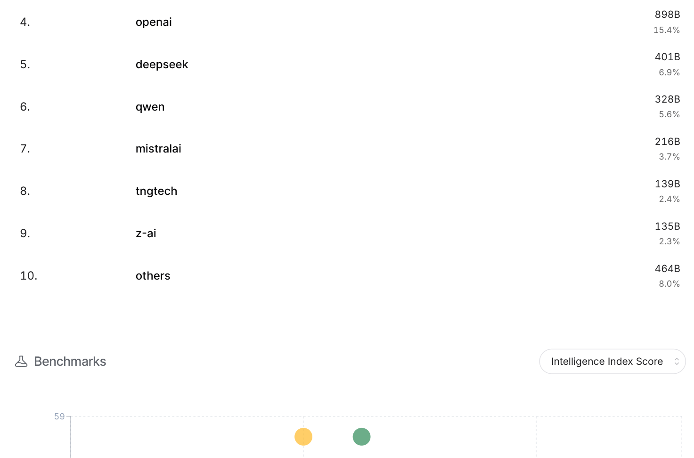
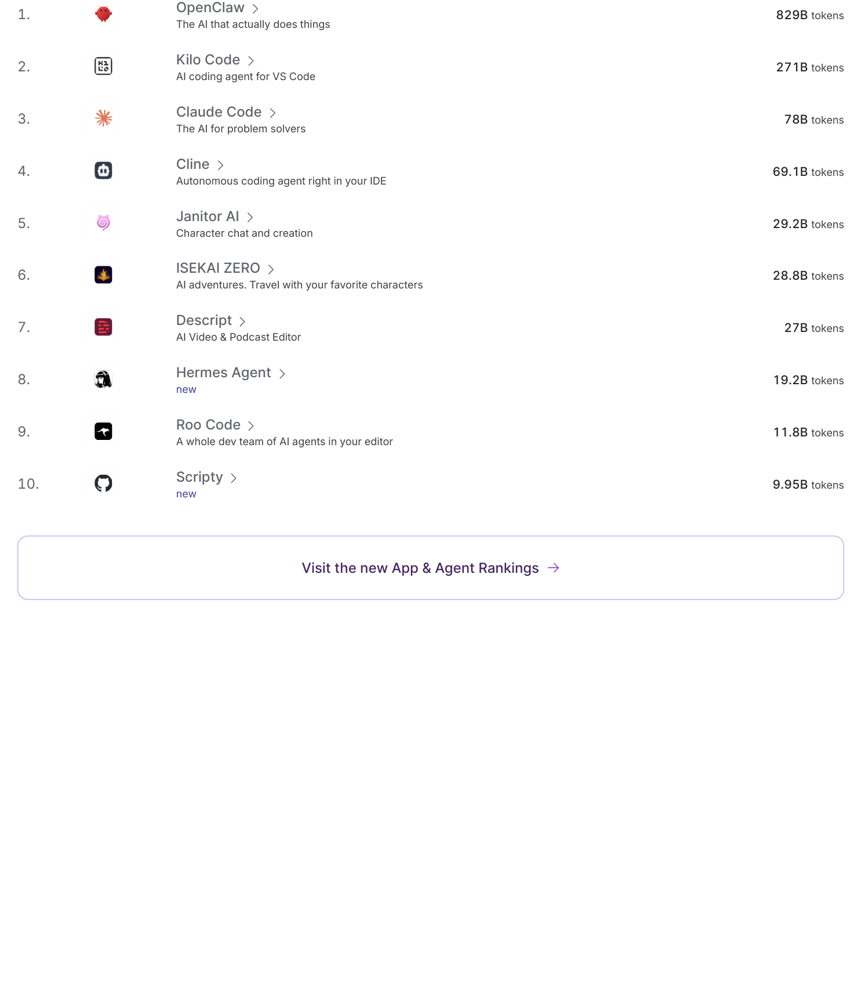

# 2025 大模型使用格局：来自 OpenRouter 的真实数据

## 数据来源
OpenRouter 是目前最大的 LLM API 聚合平台之一，汇集了数百万用户的真实使用数据。以下数据来自 OpenRouter Rankings 页面（https://openrouter.ai/rankings），统计周期为 2025 年 3 月最新一周。

## 本周模型使用量趋势

## 本周 Top 10 模型排行

| 排名 | 模型 | 厂商 | 本周 Token 使用量 | 周环比 |
|:---:|------|------|:---:|:---:|
| 1 | MiMo-V2-Pro | 小米 (xiaomi) | 3.96T | +165% |
| 2 | Step 3.5 Flash (free) | 阶跃星辰 (stepfun) | 1.49T | +1% |
| 3 | MiniMax M2.7 | MiniMax | 1.29T | +253% |
| 4 | DeepSeek V3.2 | DeepSeek | 1.24T | +9% |
| 5 | Claude Sonnet 4.6 | Anthropic | 1.04T | -0% |
| 6 | Claude Opus 4.6 | Anthropic | 995B | +2% |
| 7 | Gemini 3 Flash Preview | Google | 972B | +3% |
| 8 | GLM 5 Turbo | 智谱 (z-ai) | 968B | -6% |
| 9 | MiniMax M2.5 | MiniMax | 909B | -30% |
| 10 | Grok 4.1 Fast | x-ai | 599B | +32% |

**关键发现**：
- Top 10 中，中国厂商模型占据 6 席（小米、阶跃星辰、MiniMax×2、DeepSeek、智谱）
- 小米 MiMo-V2-Pro 以 3.96T tokens 大幅领先，周增长 165%
- MiniMax M2.7 增长最猛，周增长 253%
- Anthropic 两款模型（Sonnet 4.6 + Opus 4.6）合计约 2T，但增长停滞

## 厂商市场份额（按 Token 量）

| 排名 | 厂商 | 本周 Token 量 | 市场份额 |
|:---:|------|:---:|:---:|
| 1 | 小米 (xiaomi) | 1.31T | 25.9% |
| 2 | Google | 594B | 11.8% |
| 3 | Anthropic | 555B | 11.0% |
| 4 | MiniMax | 429B | 8.5% |
| 5 | OpenAI | 400B | 7.9% |
| 6 | 阶跃星辰 (stepfun) | 341B | 6.8% |
| 7 | DeepSeek | 334B | 6.6% |
| 8 | 智谱 (z-ai) | 326B | 6.5% |
| 9 | x-ai | 195B | 3.9% |
| 10 | 其他 | 563B | 11.2% |

**关键发现**：
- 小米以 25.9% 遥遥领先，超过第二名 Google 的两倍以上
- 中国厂商合计份额：小米 + MiniMax + 阶跃星辰 + DeepSeek + 智谱 ≈ 54.3%，超过一半
- OpenAI 仅排第五，份额 7.9%
- 市场高度分散，没有任何厂商超过 30%

## 增长最快的模型

| 模型 | 厂商 | 周增长 |
|------|------|:---:|
| MiniMax M2.7 | MiniMax | +253% |
| MiMo-V2-Pro | 小米 | +165% |
| Cline (coding agent) | 独立开发者 | +128% |
| Hermes Agent | Nous Research | +92% |
| Ampere | Ampere | +576% |
| Codex | OpenAI | +112% |

## Top 应用排行（按日 Token 消耗）

| 排名 | 应用 | 描述 | 日 Token 量 |
|:---:|------|------|:---:|
| 1 | OpenClaw | AI 生产力助手 "The AI that actually does things" | 829B |
| 2 | Kilo Code | VS Code AI 编程助手 | 271B |
| 3 | Claude Code | Anthropic 的 CLI 编程工具 | 78B |
| 4 | Cline | VS Code 自动编程 Agent | 69.1B |
| 5 | Janitor AI | 角色扮演聊天 | 29.2B |
| 6 | ISEKAI ZERO | AI 冒险游戏 | 28.8B |
| 7 | Descript | AI 视频/播客编辑器 | 27B |
| 8 | Hermes Agent | Nous Research 的 AI Agent | 19.2B |
| 9 | Roo Code | VS Code AI 编程助手 | 11.8B |
| 10 | Scripty | 新上线工具 | 9.95B |

**关键发现**：
- Top 4 应用全部是 **AI 编程工具**（OpenClaw、Kilo Code、Claude Code、Cline）
- AI Coding Agent 已成为 LLM 最大的消费场景
- 娱乐/角色扮演类应用（Janitor AI、ISEKAI ZERO）仍占一席之地
- OpenClaw 日消耗 829B tokens，几乎是第二名的 3 倍

## 行业趋势观察

1. **中国模型全球化突破**：在 OpenRouter 这一国际平台上，中国厂商模型使用量已超过一半。小米 MiMo 系列、DeepSeek V3、MiniMax M2 系列在性价比上具有显著优势。

2. **Flash/Turbo 系列碾压旗舰模型**：Step 3.5 Flash、GLM 5 Turbo、Gemini 3 Flash 等"快速便宜"模型的使用量远超对应的旗舰版本。用户用脚投票：在实际应用中，速度和成本往往比极致性能更重要。

3. **AI Coding Agent 统治使用场景**：Top 10 应用中有 5 个是编程工具。这反映了当前 LLM 最大的商业价值——帮助开发者写代码。

4. **市场高度分散**：没有任何单一模型或厂商垄断市场。Top 10 来自 8 个不同厂商，这意味着竞争依然激烈，格局远未固定。
